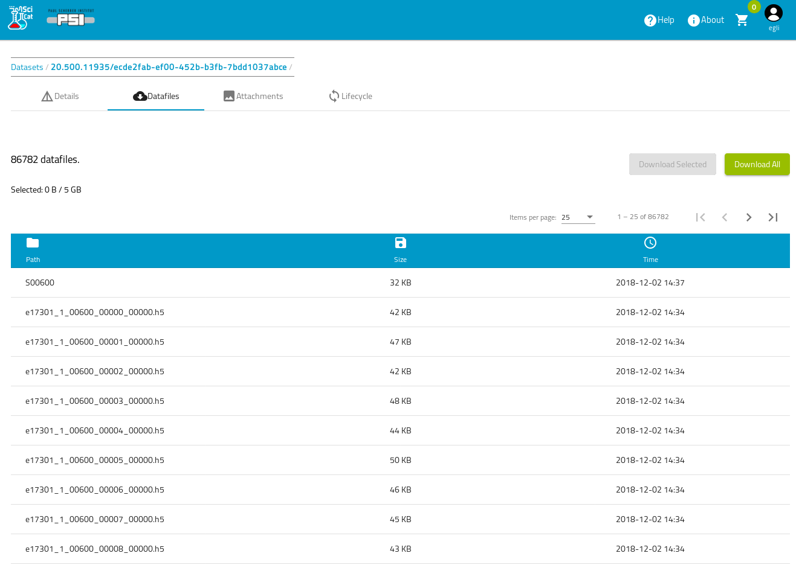

# Datasets
Datasets are defined by a set of files which comprise a self-contained measurement - fully customizeable during ingestion of meta data.

## Dataset file listing

How to use the query and search in SciCat.

## Dataset attachments

What attachement can be saved

## View raw JSON data

How can I see the JSON data

## Edit Scientific meta data

How can I edit scientifc meta data