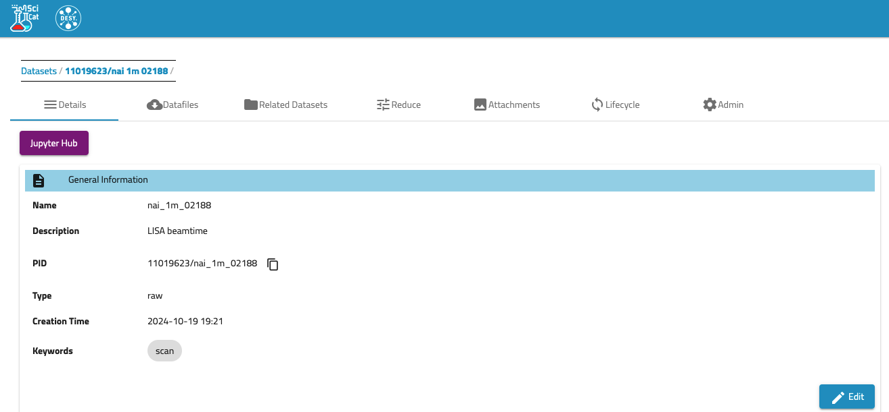
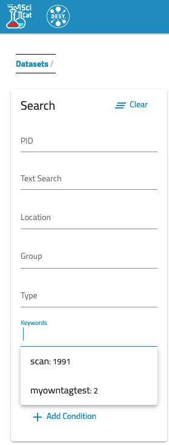
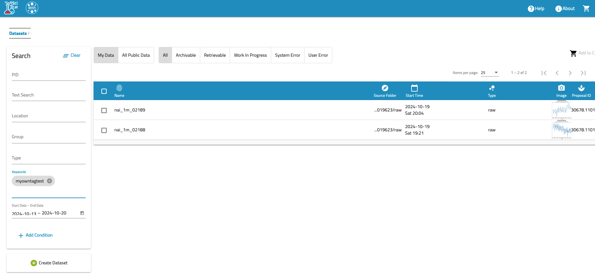

# Grouping datasets
An easy way of quickly grouping some of the datasets is the option to tag each dataset individually and then search by this tag. In the General Information of the dataset one can EDIT it by adding a new KEYWORD (note Keywords are not case sensitive). Saving this keyword enables a search on them at a later point. 

Here one sees the EDIT button (bottom right).

// erscheint noch nicht mittig...
Having added your keywords you can use them to search: 
{align=center}

On the left you see the filters of your datasets, all results with e.g. "myowntagtest".

